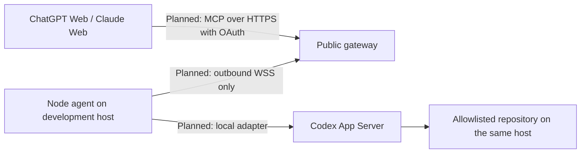

# codex-session-gateway

Self-hosted MCP gateway for securely connecting ChatGPT and Claude to existing
Codex sessions across local and remote development hosts.

> **Early development — scaffold only (0.0.0).** There is no runnable gateway,
> agent, dashboard, MCP endpoint, authentication, or Codex integration. Do not
> deploy this scaffold as a service. The development toolchain and scaffold are
> verified locally; see [bootstrap status](docs/bootstrap-status.md). GitHub
> Actions is configured but not externally verified.

## Project status

| Capability                                               | Status        | What exists                                                                         |
| -------------------------------------------------------- | ------------- | ----------------------------------------------------------------------------------- |
| Monorepo source and development configuration            | Implemented   | Metadata exports, six smoke tests, build and quality checks verified locally        |
| Architecture, examples and roadmap                       | Implemented   | Design documents; examples are not executable configuration                         |
| CI, CodeQL, dependency review and Dependabot definitions | Implemented   | Configured but not externally verified; local development is independent of Actions |
| MCP gateway and browser connectors                       | Planned       | No SDK or server installed                                                          |
| OAuth and agent credentials                              | Planned       | No authentication code                                                              |
| Outbound agent transport and Codex adapter               | Planned       | No network connections or session access                                            |
| Dashboard, persistence and deployment                    | Planned       | Documentation only                                                                  |
| Generic MCP shell or arbitrary remote filesystem access  | Not supported | Excluded from the intended interface                                                |

**Implemented** means source or documentation is present, not production ready.
**Experimental** means executable behavior under evaluation; no runtime feature
currently has this status. **Planned** means design intent without
implementation. **Not supported** means outside the supported scope.

## Problem and intended use cases

Development work can be spread across laptops, workstations and remote hosts. A
browser assistant needs an explicit, authorized way to select the correct host,
workspace and Codex thread without treating every machine as one shared shell.

Planned use cases include inspecting an existing thread, continuing work in an
allowlisted repository, observing a run, and requesting interruption. These are
project goals, not available integrations. Existing-session compatibility must
be verified against supported Codex versions before any such claim is made.

## Planned architecture



The node agent initiates the WSS connection; authorized requests would travel
over that established connection. Codex App Server would run on the machine
containing the repository. Targets would include host, workspace and thread
identity, with one active mutation per thread. The gateway would have no direct
access to remote filesystems. None of these connections exists in the scaffold.

## Monorepo

| Path                    | Responsibility                                                    |
| ----------------------- | ----------------------------------------------------------------- |
| `apps/gateway`          | Public gateway metadata; service planned                          |
| `apps/node-agent`       | Host agent metadata; service planned                              |
| `apps/dashboard`        | Documentation and package manifest only                           |
| `packages/protocol`     | Metadata and Zod dependency reserved for future runtime contracts |
| `packages/codex-client` | Metadata; local Codex adapter planned                             |
| `packages/security`     | Metadata; shared authorization primitives planned                 |
| `packages/shared`       | Metadata; shared utilities may be introduced when needed          |
| `config`                | Nonfunctional, sanitized configuration examples                   |
| `deploy`                | Caddy, Docker and systemd planning notes only                     |
| `docs`                  | Architecture, operations, security and decision records           |
| `scripts`               | Local documentation and preventive secret checks                  |
| `.github`               | Community templates and automation definitions                    |

All packages use `@codex-session-gateway/*`, ESM and version `0.0.0`. They
remain private in package manifests to prevent accidental package publishing;
the intended GitHub repository is public. Changesets can version private
packages.

## Development quick start

Use an unprivileged account, Node.js **24.20.0 LTS** (pinned in `.node-version`)
and pnpm **10.34.5** (pinned in `package.json`). See the verified
[toolchain installation method](docs/toolchain.md). The generated
`pnpm-lock.yaml` is committed; frozen installation is the normal local and CI
workflow.

Run the entire suite locally from the repository root:

```sh
pnpm install --frozen-lockfile
pnpm lint
pnpm format:check
pnpm typecheck
pnpm test
pnpm build
pnpm check:docs
pnpm check:secrets
pnpm audit --audit-level high
```

Build emits only metadata modules and declarations into ignored `dist/` folders.
There is no `start` command and no development HTTP server. See
[development](docs/development.md) for formatting and Changesets usage.

## Future runtime requirements

**Planned:** a public HTTPS origin, an OAuth design compatible with the selected
clients, outbound WSS access from development hosts, and a supported local Codex
App Server on each repository host. Client account eligibility, protocol
versions, operating systems, credential storage and persistent state are not yet
validated. No DNS, certificate, firewall, SSH or service configuration is
supplied or changed.

## Security model

**Planned:** deny by default, least privilege, explicit target authorization,
workspace allowlists enforced locally, scoped revocable agent credentials and
per-thread mutation locks. Repository content and model output are untrusted.
Credentials, raw transcripts and sensitive tool payloads must not enter normal
logs. A compromised gateway must not bypass the agent's local policy. There is
no generic shell MCP tool. No runtime enforcement exists yet.

Read the [security model](docs/security-model.md) and
[threat model](docs/threat-model.md). The local secret checker is preventive and
heuristic; it cannot certify that a repository contains no secrets.

## Documentation

Start with [getting started](docs/getting-started.md) and
[architecture](docs/architecture.md). Other entry points are
[authentication](docs/authentication.md), [MCP tools](docs/mcp-tools.md),
[transport requirements](docs/gateway-agent-protocol.md),
[configuration](docs/configuration.md), [ChatGPT](docs/chatgpt-connector.md),
[Claude](docs/claude-connector.md), [operations](docs/operations.md) and
[troubleshooting](docs/troubleshooting.md).

## Roadmap and contributing

[ROADMAP](ROADMAP.md) identifies future milestones without delivery dates. Use
[CONTRIBUTING](CONTRIBUTING.md) for branch workflow, checks and Conventional
Commits, and [SUPPORT](SUPPORT.md) for questions. Maintainer: Alberto Lopez -
Alcybercloud.it (GitHub owner: `peronslayer`). Repository:
<https://github.com/peronslayer/codex-session-gateway>. Source publication and
local scaffold verification do not constitute a release or validation of the
planned runtime integrations.

## Vulnerability reporting

**Do not open public issues for vulnerabilities.** Follow
[SECURITY](SECURITY.md). A verified private reporting channel is a bootstrap
requirement; do not post sensitive details while that channel is pending.

## License and independence

Copyright 2026 Alberto Lopez - Alcybercloud.it. Code is licensed under
[Apache License 2.0](LICENSE). The [Code of Conduct](CODE_OF_CONDUCT.md) uses
Contributor Covenant 2.1 with its upstream attribution preserved.

This is an independent open-source project and is not affiliated with, endorsed
by, or sponsored by OpenAI, Anthropic, Microsoft, or Visual Studio Code.
