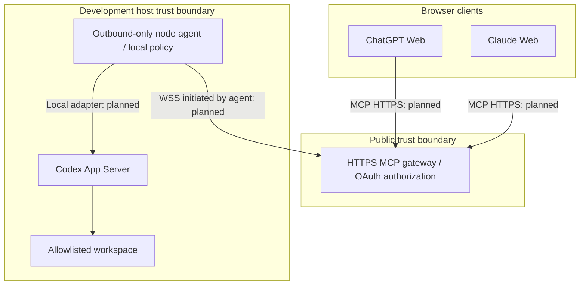

# Architecture

**Status: Planned**. Only component identity exports and development files are
**Implemented**. This document specifies direction, not existing functionality.

## Actors and boundaries

ChatGPT Web and Claude Web are intended MCP clients. Their supported transports,
OAuth requirements and account eligibility must be validated in M1.1 and M3.3.
They would call a public HTTPS gateway using OAuth-authorized MCP requests.

Distributed node agents would initiate authenticated WSS connections exclusively
outbound to the gateway. Agents would not require inbound public ports. Logical
commands can travel back over the connection established by the agent.

Codex App Server would execute on the same development machine that contains the
repository. The node agent would use a reviewed local adapter. The gateway has no
direct access to remote filesystems, repository mounts, SSH keys or Codex
credentials. There is no SSH transport in the proposed gateway architecture.

## Explicit targets and execution

A target must identify a host and workspace, plus a thread for thread-specific
operations. Starting a thread requires an authorized host/workspace pair first.
Target selection must be scoped to the authenticated principal and client context;
a process-global current target would risk cross-user confusion. Every subsequent
operation must recheck authorization and parent-child ownership.

Mutating execution requires an exclusive per-thread lock. The authority and
persistence of that lock, fencing after disconnect and interactions with other
local Codex clients are unresolved M1.4/M2.4 requirements. A gateway-only mutex
would not prove exclusivity across hosts or independent clients. Read consistency,
interruption and retry behavior must be specified before implementation.

## Component responsibilities

- Gateway: client authentication, target authorization, routing and bounded run
  metadata; never arbitrary remote file operations.
- Node agent: enforce local workspace policy independently, map authorized IDs to
  local resources, mediate the Codex adapter and enforce execution limits.
- Protocol: versioned schemas after transport review; Zod is declared but unused.
- Codex client: local integration and compatibility checks after validation.
- Security/shared: reusable primitives only when concrete requirements justify them.
- Dashboard: optional UI, with no selected frontend framework.

Persistence, transport envelopes, delivery guarantees and OAuth implementation are
undecided. See [ADR 0002](adr/0002-outbound-node-agents.md),
[protocol requirements](gateway-agent-protocol.md), and
[threat model](threat-model.md).
